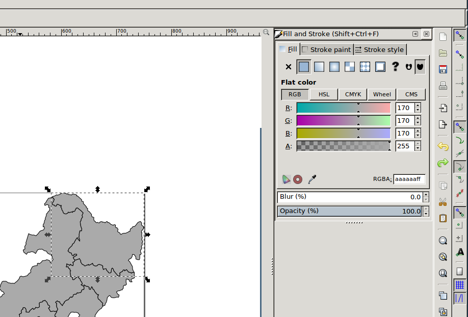
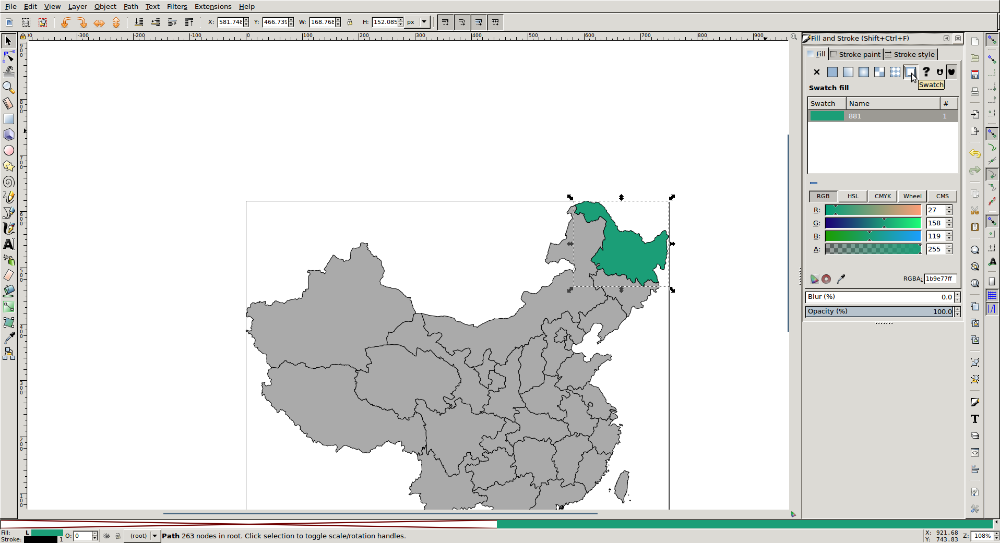
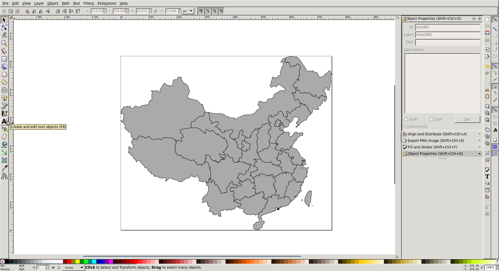
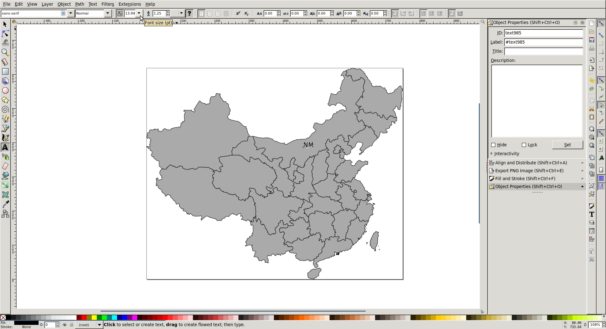
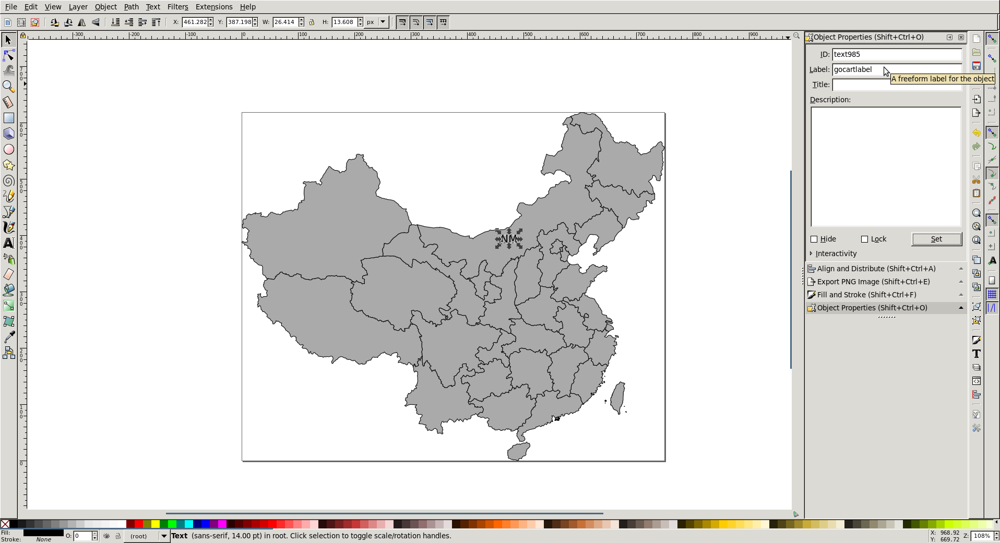
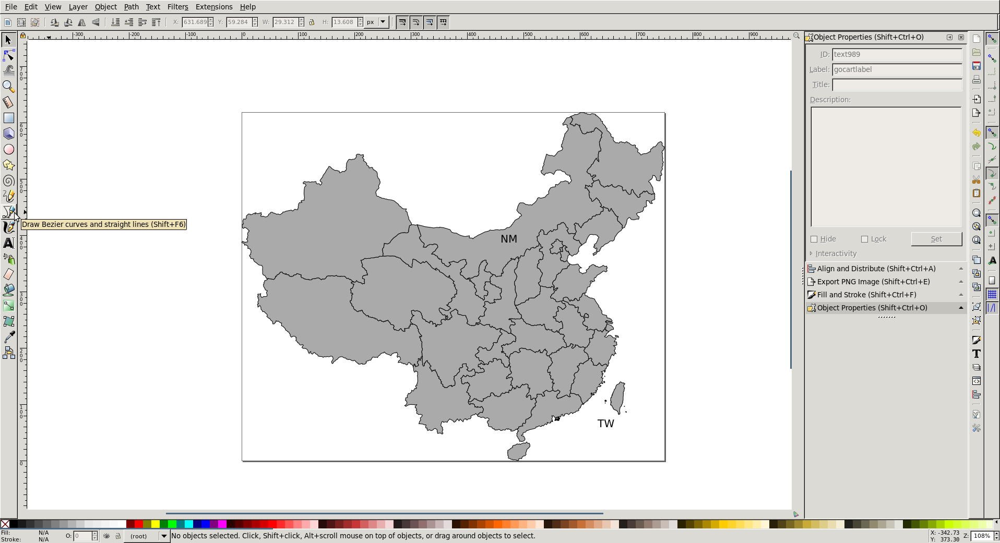
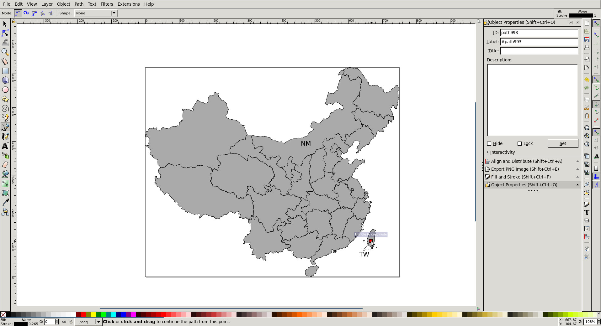
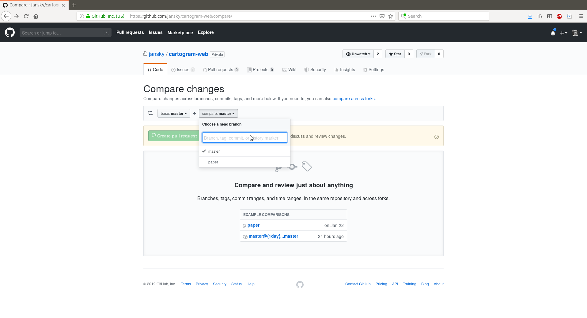

# Adding a Map

This guide will help you add a new map to the go-cart.io website. This guide assumes that you have already set up the website code for local testing and development.

## What You'll Need

To add a map, you will need the following files, information, and software:

* Conventional map geography, in .gen format
* Map region names and abbreviations
* A sample dataset (e.g. GDP)
* Population and land area (in km^2) for each map region
* Inkscape, a free, open-source vector graphics editor for Windows, Mac, and Linux that can be downloaded at https://inkscape.org/. 

## Preparing Your Data

The first step in adding a map is to prepare your data. First, you will need to copy the .gen file for the conventional map into `CARTOGRAM_DATA_DIR` (the folder where the C code lives). Then, you will need to create a .dat file for your map. This file will contain the names and abbreviations of your map, and your sample dataset. It is a text file that contains one entry per line. Each entry should look like (brackets should be omitted):

    [Region ID] [Sample Dataset Value] [Region Name] [Region Abbreviation]

The region IDs in the .dat file should correspond to the region IDs in your .gen file. For your reference, here is a .dat file for Germany:

    1 1787408 Hamburg HH
    2 7926599 Niedersachsen NI
    3 671489 Bremen HB
    4 17865516 Nordrhein-Westfalen NW
    5 6176172 Hessen HE
    6 4052803 Rheinland-Pfalz RP
    7 10879618 Baden-Wuerttemberg BW
    8 12843514 Bayern BY
    9 995597 Saarland SL
    10 3520031 Berlin BE
    11 2484826 Brandenburg BB
    12 1612362 Mecklenburg-Vorpommern MV
    13 4084851 Sachsen SN
    14 2245470 Sachsen-Anhalt ST
    15 2170714 Thueringen TH
    16 2858714 Schleswig-Holstein SH

Some region names may contain accent marks or other unicode characters. Please use only ASCII characters in your .dat file. For example, in the .dat file above Thüringen is rendered as 'Theuringen'.

When you're finished creating your .dat file, you should save it in `CARTOGRAM_DATA_DIR`.

## Initializing Your Map

Before creating a new map, you should create a Git branch to contain your work. Open a Terminal window and navigate to the `internal/` directory of the repository. Then, run

    $ git checkout -b add-my-map-name

You should never add maps or make other changes on the default `master` branch!

From here on, you will be making use of the Add Map Wizard. Before you can use this wizard to initialize your new map, you must enter the Python virtual environment used by the go-cart.io website code. To do this, run

    $ source ./setupenv.sh

Your command prompt should change to indicate the you are in the virtual environment:

    (venv) $

Now you can run the Add Map Wizard. You will need to pick a name for your map to be used by the website code (this is different from the user-friendly name seen by website users). This name **must not** include spaces, hyphens, underscores, or any punctuation. Below are some example names for your reference:

    Map                     | Code Name
    United States           | usa
    Mainland China & Taiwan | china
    Germany                 | germany

This code name must be unique. The Add Map Wizard will let you know if your choice of code name has already been taken.

Once you have chosen a code name, you can run the Add Map Wizard:

    (venv) $ python addmap.py init your-code-name

The wizard will then ask you a series of questions about your map, and generate files needed to complete the map addition process.

    (venv) $ python addmap.py init france

    Welcome to the Add Map Wizard!

    Enter a user friendly name for this map: France

    Now I need to know where the .gen and .dat files for this map are located. These files should be located in the CARTOGRAM_DATA_DIR directory. You should supply me with a path relative to CARTOGRAM_DATA_DIR.
    E.G: The .gen file for this map is located at CARTOGRAM_DATA_DIR/map.gen. Enter "map.gen".

    Enter the location of the .gen file for this map: france.gen
    Enter the location of the .dat file for this map: france.dat
    What are the regions of this map called (e.g. State, Province)? Department
    What is the name of the dataset in the .dat file (e.g. GDP)? GDP

    Writing handlers/france.py...
    Writing static/cartdata/france/config.json...
    Writing static/cartdata/france/abbreviations.json...
    Writing static/cartdata/france/colors.json...
    Writing static/cartdata/france/template.csv...

    I will now create france.svg. You should edit this file to specify the default color and add labels for each region.
    DO NOT RESIZE OR RESCALE THE CONTENTS OF THIS FILE! Accurate label placement depends on the scale calculated by this wizard.

    Writing france.svg...
    Writing static/cartdata/france/labels.json...

    I will now create france-landarea.csv and france-population.csv. You should edit these files to specify the land area (in square kilometers) and population of each region.
    DO NOT ALTER THE COLOR INFORMATION IN THESE FILES! You should specify the color for each region by editing france.svg

    Writing france-landarea.csv...
    Writing france-population.csv...

    I will now modify web.py to add your new map. Before I do this, I will back up the current version of web.py to web.py.bak.

    Backing up web.py...
    Editing web.py...

    All done!

If there is a problem, the wizard will print an error message, clean up, and exit. If an error occurs while the wizard is editing `web.py`, and this file becomes corrupted, you will need to restore the backup manually. You can do this by running:

    (venv) $ cp web.py.bak web.py

## Adding the Rest of Your Data

At this point, the Add Map Wizard has produced several files in the `internal/` directory that you'll need to edit to complete the map addition process. First, you should edit `your-map-landarea.csv` and `your-map-population.csv` to add the population and land area information for each map region. You can edit these manually, using a text editor, or with a spreadsheet program like LibreOffice Calc or Microsoft Excel.

Now, by editing `your-map.svg` using Inkscape, you will set the default color for each map region and add labels for the conventional map. 

### Adding Colors

The go-cart.io website uses the same color scheme for all maps. The six colors you should use are listed below in Hex form, and can be seen by going to the [color scheme page](http://colorbrewer2.org/#type=qualitative&scheme=Dark2&n=6) on ColorBrewer:

    #1b9e77
    #d95f02
    #7570b3
    #e7298a
    #66a61e
    #e6ab02

Open `your-map.svg` in Inkscape. You should see a rendered version of your conventional map, with each region shaded with a light-gray:

To make adding colors easier, you will create a custom palette with the six colors in the ColorBrewer color scheme. To do this, click the left-pointing arrow at the bottom right corner of the Inkscape window. Then, select the 'Auto' palette. The color palette bar at the bottom of the window should then appear like in the screenshot above.

Now, right-click on a region you want to color, and select 'Fill and Stroke...'. A panel should open on the right-hand side of the Inkscape window:

Now, enter the Hex code for the color you want into the textbox labeled 'RGBA'. Add `ff` to the end for full opacity:

Now, click the swatch button (to the left of the question mark button in the Fill and Stroke panel). This will add the color to the palette bar:

Repeat this process for the remaining five colors. When you are finished, the palette bar should look something like:

Now the coloring process becomes significantly easier. Left click on each region you want to color, and then left click on the color in the palette bar you want to apply to that region. Color the map as you wish while keeping in mind the following constraints:

* Neighboring regions **must not** have the same color.
* The distribution of colors throughout the map should be roughly equal. The default colors are not used to indicate data, but instead to allow users to clearly see the region boundaries.

Some of your map regions may include many small polygons that are hard to spot in Inkscape. You don't have to color each one. The Add Map Wizard only requires that you color **one** polygon per map region (usually it is easiest if you color the largest one).

When you are done coloring each region, you should save your SVG file by going to `File -> Save`.

### Adding Labels

The go-cart.io website displays labels on the conventional map, which consist of text for region abbreviations, and lines. You can use Inkscape to add these labels. Open `your-map.svg` in Inkscape.

First, we'll add a text label. Click the text tool on the toolbar, left click on the map where you want to place the text label, and type the text you want to appear in the label.

After you've added the text label, go to `Text -> Convert to Text` in the menubar (if you don't do this, then the text label won't be detected by the Add Map Wizard). Then, adjust the font size to 14 so that the label text appears as it would on the website. The font size of the labels in Inkscape does not affect their appearance on the website, but setting it appropriately will make it easier for you to place them correctly.

Now, go to `Object -> Object Properties...`. Set the 'Label' field to `gocartlabel`, and click 'Set'. This will help the Add Map Wizard find your text labels in the SVG document.

If a region is too small to contain a text label, you can place the text label outside the map (but still within the bounding box), and include a line pointing from the label to the region. Click the line tool on the toolbar. Then, left click once on the image where you want the line to start. Left click again where you want the line to end, and right click to finish.

Again, go to `Object -> Object Properties...`. Set the 'Label' field to `gocartlabel`, and click 'Set'.

Once you have finished adding all of your labels, you should save your SVG file by going to `File -> Save`.

### Finishing Up

At this point, you're now ready to finish the map addition process. Open a Terminal window and navigate to the `internal/` directory of the repository. Then, run

    $ source ./setupenv.sh

Your command prompt should change to indicate the you are in the virtual environment:

    (venv) $

Now you can run the Add Map Wizard again:

    (venv) $ python addmap.py data your-code-name

## Saving Your Changes

You should commit your changes to your Git branch, and push these changes to GitHub.

    $ git add handlers
    $ git add static
    $ git commit -a -m "added map New Map Name"
    $ git push origin add-my-map-name

Then, revert back to the master branch:

    $ git checkout master
You should also create a pull request on GitHub to let me know that you have finished adding the new map, so I can deploy it to the website. Navigate to https://github.com/jansky/cartogram-web/compare/, select your branch, and click 'Create pull request'.

